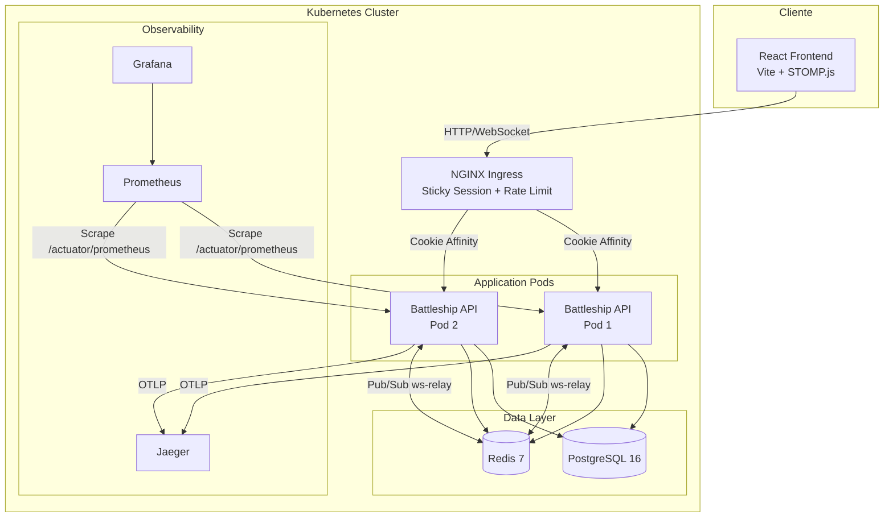
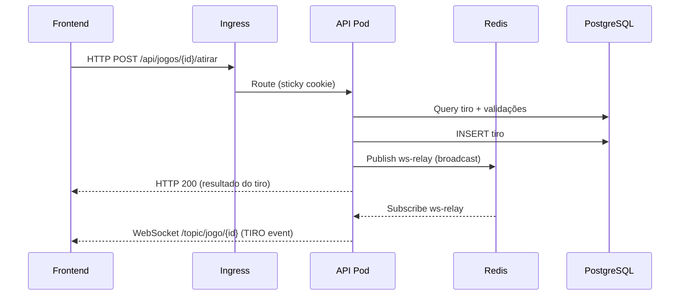
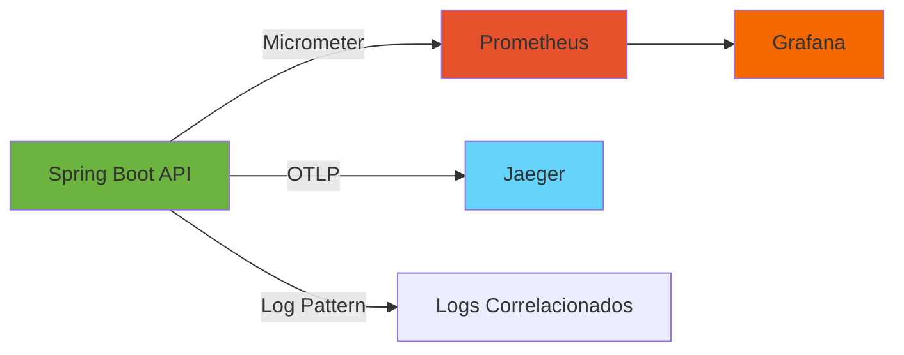
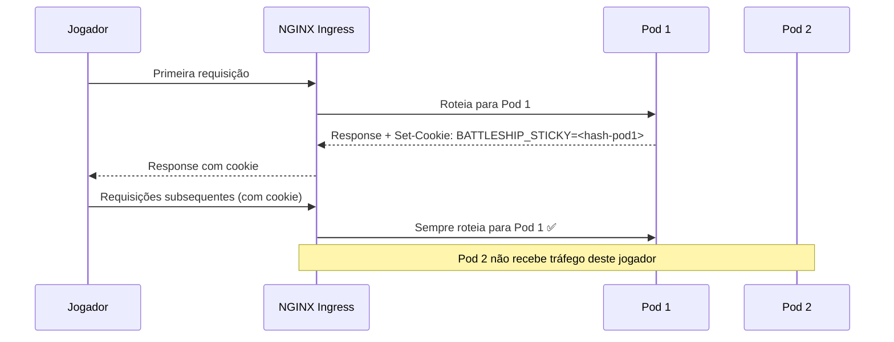
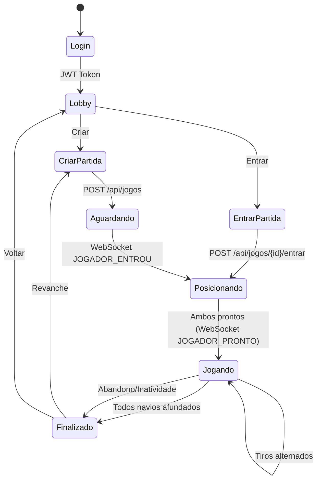

# ⚓ Battleship — Documentação Técnica

> Jogo de Batalha Naval multiplayer em tempo real com tema Minecraft, arquitetura distribuída e observabilidade completa.

---

## Índice

1. [Visão Geral](#1-visão-geral)
2. [Arquitetura](#2-arquitetura)
3. [Como Executar o Projeto](#3-como-executar-o-projeto)
4. [Observabilidade](#4-observabilidade)
5. [Resiliência e Melhorias](#5-resiliência-e-melhorias)
6. [Testes de Carga](#6-testes-de-carga)
7. [Kubernetes](#7-kubernetes)
8. [Estrutura do Projeto](#8-estrutura-do-projeto)
9. [Endpoints](#9-endpoints)
10. [Fluxo do Jogo](#10-fluxo-do-jogo)
11. [Screenshots](#11-screenshots)
12. [Conclusão](#12-conclusão)

---

## 1. Visão Geral

### Descrição

O **Battleship** é um jogo de Batalha Naval multiplayer online desenvolvido como projeto acadêmico, com foco em arquitetura distribuída, observabilidade e resiliência. O jogo possui tema visual inspirado no Minecraft, com skins de personagens, efeitos sonoros temáticos e interface pixelada.

### Objetivo

Implementar uma aplicação web completa que demonstre:

- Comunicação em tempo real via WebSocket/STOMP
- Arquitetura pronta para produção com Kubernetes
- Observabilidade end-to-end (métricas, traces, logs correlacionados)
- Padrões de resiliência (cache, rate limiting, graceful degradation)
- Testes de carga e validação de performance

### Tecnologias Utilizadas

| Camada | Tecnologias |
|--------|-------------|
| **Backend** | Java 21, Spring Boot 4.1, Spring Security, Spring WebSocket, Spring Data JPA, Spring Cache |
| **Frontend** | React 18, Vite 5.4, STOMP.js 7.3, React Router 6, CSS Modules |
| **Banco de Dados** | H2 (desenvolvimento), PostgreSQL 16 (produção) |
| **Cache** | Redis 7 (produção), ConcurrentMapCacheManager (desenvolvimento) |
| **Mensageria** | Redis Pub/Sub (relay WebSocket entre pods) |
| **Observabilidade** | Micrometer, Prometheus, Grafana 11.1, OpenTelemetry, Jaeger 1.58 |
| **Infraestrutura** | Docker, Kubernetes (Kind), NGINX Ingress Controller |
| **Testes de Carga** | k6 (Grafana) |
| **Autenticação** | JWT (HMAC-SHA, 24h expiração) |

### Modos de Jogo

| Modo | Descrição |
|------|-----------|
| **PADRÃO** | Tiro único por turno. Acertou? Joga novamente. |
| **EXPLOSÃO** | N tiros por turno (N = navios vivos). Sempre alterna turno. |

---

## 2. Arquitetura

### Diagrama Geral



### Estrutura Backend (Spring Boot 4.1)

```
battleship-api/src/main/java/com/ana/battleship/
├── BattleshipApplication.java        # Entry point (@EnableScheduling)
├── controller/
│   ├── AuthController.java           # Registro, login, skin
│   ├── JogoController.java           # Endpoints do jogo (CRUD, tiros, lobby)
│   └── HealthController.java         # Health check
├── service/
│   ├── AuthService.java              # JWT, UserDetailsService, validações
│   └── JogoService.java              # Lógica do jogo, cache, modos
├── model/
│   ├── Jogo.java                     # Entidade partida
│   ├── Usuario.java                  # Entidade jogador
│   ├── Tabuleiro.java                # Entidade tabuleiro
│   ├── Navio.java                    # Entidade navio (tipo, posição, acertos)
│   └── Tiro.java                     # Entidade tiro (resultado)
├── repository/
│   ├── JogoRepository.java           # Queries customizadas (JPQL)
│   ├── UsuarioRepository.java
│   ├── TabuleiroRepository.java
│   ├── NavioRepository.java
│   └── TiroRepository.java
└── config/
    ├── SecurityConfig.java           # JWT Filter, Rate Limit Filter, CORS
    ├── WebSocketConfig.java          # STOMP broker, JWT auth no CONNECT
    ├── CacheConfig.java              # Redis cache (condicional)
    ├── LocalCacheConfig.java         # ConcurrentMap fallback
    ├── SchedulerConfig.java          # Expiração de salas, inatividade
    ├── RedisWebSocketRelay.java      # Pub/Sub entre pods
    ├── LocalWebSocketConfig.java     # Broadcaster local (sem Redis)
    ├── ObservabilityConfig.java      # @Observed aspect
    ├── BusinessMetrics.java          # Métricas de negócio customizadas
    ├── WebSocketMetrics.java         # Métricas WebSocket
    ├── WebSocketEventListener.java   # Grace period 30s no disconnect
    ├── RateLimitFilter.java          # Token bucket por IP
    ├── GlobalExceptionHandler.java   # Tratamento centralizado
    └── CorsConfig.java              # CORS permissivo
```

### Estrutura Frontend (React 18 + Vite)

```
battleship-frontend/src/
├── main.jsx                    # Entry point (LanguageProvider)
├── App.jsx                     # Router + Background music
├── index.css                   # Global theme (Minecraft dark)
├── components/
│   ├── Login.jsx               # Tela de login (Microsoft style)
│   ├── Register.jsx            # Cadastro
│   ├── Lobby.jsx               # Menu principal (Minecraft title)
│   ├── CriarPartida.jsx        # Criar sala + código
│   ├── EntrarPartida.jsx       # Entrar por código ou lista
│   ├── Jogo.jsx                # Orquestrador principal (~500 linhas)
│   ├── Posicionamento.jsx      # Grid de posicionamento
│   ├── Tabuleiro.jsx           # Grid 10x10 (ataque/defesa)
│   ├── GameOverScreen.jsx      # Tela de vitória/derrota
│   ├── FrotaInimiga.jsx        # Inventário de navios (hotbar)
│   ├── HeartBar.jsx            # Barra de vida (corações)
│   ├── Options.jsx             # Configurações
│   ├── Skins.jsx               # Seleção de skins (13 opções)
│   └── PrivateRoute.jsx        # Guard de autenticação
├── services/
│   ├── api.js                  # Cliente REST (JWT auto-inject)
│   ├── websocket.js            # STOMP client (singleton, reconnect)
│   └── audioManager.js         # Gerenciador de áudio (singleton)
└── i18n/
    ├── LanguageContext.jsx      # Provider + hook useTranslation
    ├── pt-BR.js                # Traduções português
    └── en-US.js                # Traduções inglês
```

### Fluxo de Comunicação




---

## 3. Como Executar o Projeto

### Pré-requisitos

| Ferramenta | Versão Mínima | Uso |
|-----------|---------------|-----|
| Java JDK | 21 | Backend |
| Maven | 3.9+ | Build backend |
| Node.js | 18+ | Frontend |
| Docker | 24+ | Containers |
| kubectl | 1.28+ | Kubernetes (opcional) |
| Kind | 0.20+ | Cluster local (opcional) |

### Variáveis de Ambiente

**Backend (`battleship-api`):**

| Variável | Padrão | Descrição |
|----------|--------|-----------|
| `PORT` | `8080` | Porta do servidor |
| `DB_URL` | `jdbc:h2:file:./data/battleship` | URL do banco de dados |
| `DB_USERNAME` | `sa` | Usuário do banco |
| `DB_PASSWORD` | *(vazio)* | Senha do banco |
| `DB_DRIVER` | `org.h2.Driver` | Driver JDBC |
| `JPA_DDL_AUTO` | `create` | Estratégia DDL (create/update) |
| `JWT_SECRET` | *(configurado no yml)* | Chave secreta para tokens JWT |
| `SPRING_REDIS_HOST` | `localhost` | Host do Redis |
| `OTEL_EXPORTER_OTLP_ENDPOINT` | `http://localhost:4318` | Endpoint do Jaeger/OTLP |
| `app.redis.enabled` | `false` | Habilitar Redis cache + relay |

**Frontend (`battleship-frontend/.env.local`):**

| Variável | Padrão | Descrição |
|----------|--------|-----------|
| `VITE_API_URL` | `http://localhost:8080/api` | URL base da API |
| `VITE_WS_URL` | `ws://localhost:8080/ws` | URL do WebSocket |

### Executar Backend (Desenvolvimento)

```bash
cd battleship-api

# Sem Redis (padrão - usa H2 + ConcurrentMap cache)
./mvnw spring-boot:run

# Com Redis (requer Redis rodando na porta 6379)
./mvnw spring-boot:run -Dspring-boot.run.arguments="--app.redis.enabled=true"
```

A API estará disponível em `http://localhost:8080`.
Console H2 em `http://localhost:8080/h2-console` (JDBC URL: `jdbc:h2:file:./data/battleship`).

### Executar Frontend (Desenvolvimento)

```bash
cd battleship-frontend
npm install
npm run dev
```

O frontend estará disponível em `http://localhost:5173`.

### Executar com Docker Compose (Observabilidade Completa)

```bash
# Na raiz do projeto
docker compose up -d

# Iniciar o backend apontando para os serviços Docker
cd battleship-api
./mvnw spring-boot:run -Dspring-boot.run.arguments="--app.redis.enabled=true"
```

**Serviços disponíveis:**

| Serviço | URL | Credenciais |
|---------|-----|-------------|
| API | http://localhost:8080 | — |
| Frontend | http://localhost:5173 | — |
| Redis | localhost:6379 | — |
| Prometheus | http://localhost:9090 | — |
| Grafana | http://localhost:3000 | admin / admin |
| Jaeger | http://localhost:16686 | — |

### Executar com Kubernetes (Produção)

```bash
# 1. Criar cluster Kind
kind create cluster --config kind-config.yaml

# 2. Instalar NGINX Ingress
kubectl apply -f https://raw.githubusercontent.com/kubernetes/ingress-nginx/main/deploy/static/provider/kind/deploy.yaml

# 3. Build da imagem e carregar no Kind
cd battleship-api
docker build -t battleship-api:latest .
kind load docker-image battleship-api:latest

# 4. Deploy de todos os recursos
cd ../k8s
kubectl apply -f namespace.yaml
kubectl apply -f postgres-secret.yaml
kubectl apply -f postgres-pvc.yaml
kubectl apply -f postgres-deployment.yaml
kubectl apply -f postgres-service.yaml
kubectl apply -f redis-deployment.yaml
kubectl apply -f redis-service.yaml
kubectl apply -f backend-deployment.yaml
kubectl apply -f backend-service.yaml
kubectl apply -f prometheus-config.yaml
kubectl apply -f prometheus.yaml
kubectl apply -f grafana.yaml
kubectl apply -f jaeger.yaml
kubectl apply -f ingress.yaml

# 5. Configurar /etc/hosts (ou C:\Windows\System32\drivers\etc\hosts)
# 127.0.0.1 battleship.local grafana.local prometheus.local jaeger.local
```


---

## 4. Observabilidade

A aplicação implementa observabilidade completa baseada nos **três pilares**: métricas, traces e logs correlacionados.

### Stack de Observabilidade



### 4.1 Spring Boot Actuator

Endpoints habilitados:

| Endpoint | URL | Descrição |
|----------|-----|-----------|
| Health | `/actuator/health` | Status da aplicação e dependências |
| Metrics | `/actuator/metrics` | Métricas individuais |
| Prometheus | `/actuator/prometheus` | Métricas no formato Prometheus |
| Info | `/actuator/info` | Informações da aplicação |

Configuração:
```yaml
management:
  endpoints:
    web:
      exposure:
        include: health,info,prometheus,metrics
  endpoint:
    health:
      show-details: always
```

### 4.2 Micrometer + Prometheus

**Métricas HTTP (automáticas):**
- `http_server_requests_seconds` — Latência de requisições (histograma com percentis p50, p95, p99)
- Tags: `method`, `uri`, `status`, `outcome`

**Métricas de Negócio (customizadas via `BusinessMetrics.java`):**

| Métrica | Tipo | Descrição |
|---------|------|-----------|
| `battleship_matches_finished_total` | Counter | Total de partidas finalizadas |
| `battleship_ships_sunk_total` | Counter | Total de navios afundados |
| `battleship_shots_hit_total` | Counter | Total de tiros certeiros |
| `battleship_shots_miss_total` | Counter | Total de tiros na água |
| `battleship_matches_active` | Gauge | Partidas ativas no momento |
| `battleship_match_duration` | Timer | Duração das partidas (p50, p95) |
| `battleship_lobby_wait_time` | Timer | Tempo de espera no lobby (p50, p95) |

**Métricas WebSocket (via `WebSocketMetrics.java`):**

| Métrica | Tipo | Descrição |
|---------|------|-----------|
| `spring_websocket_sessions` | Gauge | Sessões WebSocket ativas |
| `battleship_players_online` | Gauge | Jogadores online (únicos) |
| `spring_websocket_messages_received_total` | Counter | Mensagens recebidas |
| `spring_websocket_messages_sent_total` | Counter | Mensagens enviadas |

**Métricas de Cache:**

| Métrica | Descrição |
|---------|-----------|
| `cache_gets_total{result=hit}` | Cache hits |
| `cache_gets_total{result=miss}` | Cache misses |
| `cache_puts_total` | Entradas inseridas no cache |

**Métricas de Banco (HikariCP):**

| Métrica | Descrição |
|---------|-----------|
| `hikaricp_connections_active` | Conexões em uso |
| `hikaricp_connections_idle` | Conexões ociosas |
| `hikaricp_connections_pending` | Aguardando conexão |
| `hikaricp_connections_acquire_seconds` | Tempo para adquirir conexão |

**Métricas de Repositório (Spring Data):**

| Métrica | Descrição |
|---------|-----------|
| `spring_data_repository_invocations_seconds` | Latência por repositório/método |

### 4.3 OpenTelemetry + Jaeger (Traces Distribuídos)

**Configuração:**
```yaml
management:
  tracing:
    sampling:
      probability: 1.0  # 100% das requisições são traceadas
  otlp:
    tracing:
      endpoint: ${OTEL_EXPORTER_OTLP_ENDPOINT:http://localhost:4318}/v1/traces
```

**Padrões de instrumentação implementados:**

1. **Automática** — Spring Boot auto-instrumenta HTTP, JPA, cache
2. **`@WithSpan`** — Anotação para métodos específicos
3. **Manual** — `Tracer.spanBuilder()` para spans customizados
4. **`Span.current()`** — Enriquecimento de spans existentes com atributos

**Correlação de Logs:**
```
%d{yyyy-MM-dd HH:mm:ss.SSS} [%thread] %-5level %logger{36} [traceId=%mdc{traceId} spanId=%mdc{spanId}] - %msg%n
```

Todo log inclui `traceId` e `spanId`, permitindo navegar do log para o trace no Jaeger.

### 4.4 Grafana — Dashboard "Battleship Completo"

**URL:** `http://localhost:3000/d/battleship-completo` (local) ou `http://grafana.local/d/battleship-completo` (K8s)

**Painéis do Dashboard:**

| # | Painel | Tipo | Query PromQL |
|---|--------|------|-------------|
| 1 | Request Rate (req/s) | Timeseries | `rate(http_server_requests_seconds_count[1m])` |
| 2 | Response Time p95 (ms) | Timeseries | `histogram_quantile(0.95, rate(http_server_requests_seconds_bucket[1m])) * 1000` |
| 3 | JVM Memory Used | Timeseries | `jvm_memory_used_bytes` |
| 4 | Active HTTP Connections | Stat | `tomcat_connections_current_connections` |
| 5 | DB Connection Pool | Timeseries | `hikaricp_connections_active/idle/pending` |
| 6 | Slow Requests (>1s) | Timeseries | Diferença entre total e bucket ≤1s |
| 7 | Cache Hit Ratio | Gauge | `cache_gets_total{result=hit} / (hit + miss)` |
| 8 | WebSocket Sessions | Timeseries | `spring_websocket_sessions` |
| 9 | Players Online | Stat | `battleship_players_online` |
| 10 | Active Matches | Stat | `battleship_matches_active` |
| 11 | Matches Finished | Counter | `battleship_matches_finished_total` |
| 12 | Ships Sunk | Counter | `battleship_ships_sunk_total` |
| 13 | Match Duration p95 | Gauge | `battleship_match_duration` |
| 14 | Repository Latency | Timeseries | `spring_data_repository_invocations_seconds` |
| 15 | Rate Limit Blocks | Counter | Taxa de 429 responses |
| 16 | JVM Threads | Timeseries | `jvm_threads_live_threads` |

**Auto-refresh:** 10 segundos | **Retenção:** 7 dias (Prometheus)

### 4.5 Identificação de Requisições Lentas

Três abordagens complementares:

1. **Grafana** — Painel "Slow Requests (>1s)" identifica endpoints com latência acima de 1 segundo
2. **Prometheus** — Query manual:
   ```promql
   histogram_quantile(0.99, rate(http_server_requests_seconds_bucket{application="battleship-api"}[5m])) > 1
   ```
3. **Jaeger** — Busca por traces com duração > threshold, visualização de spans para identificar gargalo exato (query DB, serialização, etc.)

### 4.6 Screenshots (Observabilidade)

> 📸 **Grafana Dashboard Completo**
> 

> 📸 **Prometheus Targets**
> 

> 📸 **Jaeger — Trace de uma Requisição**
> 


---

## 5. Resiliência e Melhorias

### 5.1 Cache

#### Como Funciona

O sistema utiliza a abstração `Spring Cache` com duas implementações condicionais:

| Condição | Implementação | TTL |
|----------|---------------|-----|
| `app.redis.enabled=true` | `RedisCacheManager` | 10s (lobby), 5min (default) |
| `app.redis.enabled=false` | `ConcurrentMapCacheManager` | Sem TTL (in-memory) |

#### Onde é Utilizado

O cache é aplicado no endpoint do **lobby** (`GET /api/jogos/lobby`):

```java
@Cacheable("lobby")
public List<Map<String, Object>> getLobby(String username) { ... }

@CacheEvict(value = "lobby", allEntries = true)
public Map<String, Object> criarJogo(String username, String skin, String modo) { ... }
```

- **`@Cacheable("lobby")`** — Retorna dados do cache se disponíveis
- **`@CacheEvict`** — Invalida o cache ao criar/entrar em jogos

#### Motivo da Implementação

O lobby é o endpoint mais acessado (todos os jogadores consultam constantemente). Sem cache, cada requisição executa queries JPA com filtros de status e data, gerando carga desnecessária no banco.

#### Benefícios

- **Redução de 93%+ nas queries** — Hit rate medido de 93.3% (14 hits / 1 miss)
- **Latência de ~1-5ms** (cache) vs **~50-100ms** (banco)
- **Proteção do banco** sob alta concorrência

---

### 5.2 Correção do Sistema de Cache — Redis Opcional

#### Problema Anterior

Quando a aplicação era iniciada **sem Redis disponível**, ocorria um erro HTTP 500 em qualquer endpoint que utilizava cache:

```
org.springframework.data.redis.RedisConnectionFailureException: 
  Unable to connect to Redis; nested exception is io.lettuce.core.RedisConnectionException
```

Isso acontecia porque o `RedisCacheManager` era sempre instanciado, independente de o Redis estar acessível.

#### Solução Implementada

Foram criadas **duas configurações condicionais** ativadas pela propriedade `app.redis.enabled`:

**`CacheConfig.java` (Redis):**
```java
@Configuration
@EnableCaching
@ConditionalOnProperty(name = "app.redis.enabled", havingValue = "true")
public class CacheConfig {
    @Bean
    public RedisCacheManager cacheManager(RedisConnectionFactory factory) {
        RedisCacheConfiguration lobbyConfig = RedisCacheConfiguration.defaultCacheConfig()
            .entryTtl(Duration.ofSeconds(10))
            .serializeValuesWith(GenericJackson2JsonRedisSerializer);
        return RedisCacheManager.builder(factory)
            .withCacheConfiguration("lobby", lobbyConfig)
            .build();
    }
}
```

**`LocalCacheConfig.java` (Fallback):**
```java
@Configuration
@EnableCaching
@ConditionalOnProperty(name = "app.redis.enabled", havingValue = "false", matchIfMissing = true)
public class LocalCacheConfig {
    @Bean
    public CacheManager cacheManager() {
        return new ConcurrentMapCacheManager("lobby");
    }
}
```

**Resultado:** A aplicação inicia e funciona perfeitamente **com ou sem Redis**. O `matchIfMissing = true` garante que, por padrão (sem configuração explícita), o cache in-memory é utilizado.

---

### 5.3 Rate Limiting (Duas Camadas)

O sistema implementa rate limiting em **duas camadas** para proteção em profundidade:

#### Camada 1 — Aplicação (`RateLimitFilter.java`)

| Cenário | Limite | Bucket |
|---------|--------|--------|
| Endpoints de autenticação (`/api/auth/login`, `/api/auth/register`) | **5 req/min por IP** | Token Bucket |
| Requisições não autenticadas (geral) | **100 req/min por IP** | Token Bucket |
| Requisições autenticadas | **Sem limite** | N/A |

**Detecção de IP:** `X-Forwarded-For` → `X-Real-IP` → `remoteAddr`

**Limpeza automática:** A cada 5 minutos, remove buckets inativos há mais de 5 minutos (previne memory leak).

**Resposta ao ser limitado:**
```json
HTTP 429 Too Many Requests
{
  "erro": "Muitas tentativas. Aguarde antes de tentar novamente."
}
```

#### Camada 2 — NGINX Ingress (Kubernetes)

```yaml
nginx.ingress.kubernetes.io/limit-rps: "50"
nginx.ingress.kubernetes.io/limit-burst-multiplier: "5"
```

- **50 requisições/segundo por IP** com burst de até 250
- Proteção antes mesmo de atingir a aplicação

---

### 5.4 Gerenciamento de Inatividade

O `SchedulerConfig` implementa dois schedulers:

| Scheduler | Intervalo | Ação |
|-----------|-----------|------|
| `limparSalasExpiradas` | 60s | Expira jogos `AGUARDANDO` há mais de 2 minutos |
| `verificarInatividade` | 15s | Finaliza jogos `JOGANDO/POSICIONANDO` inativos há >2min |

Quando um jogo é finalizado por inatividade:
- O oponente é declarado vencedor (se aplicável)
- Um evento `ABANDONO` é broadcast via WebSocket
- O motivo `"inatividade"` é incluído no payload

---

### 5.5 Grace Period no WebSocket (30 segundos)

O `WebSocketEventListener` implementa um **grace period** de 30 segundos ao detectar desconexão:

```java
// Ao desconectar: agenda abandon em 30s
ScheduledFuture<?> future = scheduler.schedule(
    () -> jogoService.abandonarPartida(username), 30, TimeUnit.SECONDS);
disconnectTimers.put(username, future);

// Ao reconectar: cancela o timer
ScheduledFuture<?> pendingDisconnect = disconnectTimers.remove(username);
if (pendingDisconnect != null) pendingDisconnect.cancel(false);
```

**Benefício:** Previne abandonos falsos causados por instabilidade momentânea de rede (refresh de página, troca de rede WiFi, etc.).

---

### 5.6 WebSocket Multi-Pod (Redis Pub/Sub Relay)

Em ambiente Kubernetes com múltiplas réplicas, o `RedisWebSocketRelay` garante que eventos de jogo são entregues a **todos os jogadores**, independente de qual Pod estão conectados:

```
Jogador A (Pod 1) → Atirar → Pod 1 processa →
  ├── Entrega local (Pod 1) → Jogador A recebe via WebSocket
  └── Publica no Redis canal "ws-relay" → Pod 2 recebe → Jogador B recebe via WebSocket
```

Cada Pod possui um `podId` único para evitar processar suas próprias mensagens.

---

### 5.7 Tratamento Centralizado de Exceções

O `GlobalExceptionHandler` captura exceções e retorna respostas padronizadas:

| Exceção | Status HTTP | Uso |
|---------|-------------|-----|
| `IllegalArgumentException` | 400 Bad Request | Validações de negócio |
| `IllegalStateException` | 409 Conflict | Estado inconsistente |
| `SecurityException` | 403 Forbidden | Ação não autorizada |

---

### 5.8 Validação de Registro

O `AuthService` implementa validações rigorosas no registro:

- Username com mínimo de 4 caracteres
- Senha deve conter ao menos um caractere especial
- Email com formato válido e domínio em whitelist (17 domínios aceitos)
- Verificação de username e email duplicados


---

## 6. Testes de Carga

### Ferramenta

**k6** (Grafana Labs) — ferramenta moderna de testes de carga escrita em Go, com scripts em JavaScript.

### Cenários Implementados

| Teste | Arquivo | VUs | Duração | Objetivo |
|-------|---------|-----|---------|----------|
| Load Test | `k6/load-test-local.js` | 0→20→50→0 | 2m30s | Validar performance sob carga típica |
| Stress Test | `k6/stress-test.js` | 0→100 | 3m30s | Encontrar limites da aplicação |
| Rate Limit Test | `k6/rate-limit-local.js` | 20 | 30s | Validar eficácia do rate limiting |
| Auth Rate Limit | `k6/auth-rate-limit-test.js` | 10+1 | 30s | Stress no endpoint de login |

### Cenário Principal — Load Test

**Configuração:**
```javascript
export const options = {
    stages: [
        { duration: '30s', target: 20 },   // Ramp-up
        { duration: '1m', target: 20 },    // Sustentado
        { duration: '10s', target: 50 },   // Pico
        { duration: '30s', target: 50 },   // Sustentado (pico)
        { duration: '20s', target: 0 },    // Ramp-down
    ],
    thresholds: {
        http_req_duration: ['p(95)<500'],
        http_req_failed: ['rate<0.05'],
    },
};
```

**Fluxo por iteração:**
1. Setup: Registra usuário único → obtém JWT
2. Loop: `GET /api/jogos/lobby` (autenticado) + `GET /api/health`

### Resultados Obtidos

**Data:** 28/07/2026 | **Ambiente:** Local (WSL2 + Docker Compose) | **Banco:** H2

| Métrica | Valor |
|---------|-------|
| Total de requisições | 7.721 |
| Requisições/segundo | **51.2 req/s** |
| Iterações completadas | 3.860 |
| VUs máximo | 50 |
| Latência média | **1.83ms** |
| p50 | 1.70ms |
| p90 | 2.42ms |
| **p95** | **2.75ms** ✅ |
| p99 | ~5ms |
| Latência máxima | 80.31ms |
| Dados recebidos | 3.3 MB (22 kB/s) |
| Dados enviados | 1.6 MB (11 kB/s) |

**Threshold p95 < 500ms:** ✅ PASSOU (2.75ms — 181x abaixo do limite)

### Resultados — Rate Limit Test

| Métrica | Valor |
|---------|-------|
| Total de requisições | 175.650 |
| Requisições/segundo | **5.279 req/s** |
| Requisições bloqueadas (429) | 175.630 |
| **Taxa de bloqueio** | **99.997%** |
| Aplicação responsiva durante ataque | ✅ Sim |

**Conclusão:** O rate limiter bloqueou efetivamente o tráfego malicioso enquanto a aplicação permaneceu 100% responsiva para requisições legítimas.

### Como Executar os Testes

```bash
# Instalar k6 (Windows)
choco install k6

# Load test local
k6 run k6/load-test-local.js

# Com variável de ambiente customizada
k6 run --env BASE_URL=http://localhost:8080 k6/load-test-local.js

# Rate limit test
k6 run k6/rate-limit-local.js

# Stress test (requer cluster K8s)
k6 run k6/stress-test.js
```

### Screenshots (Testes de Carga)

> 📸 **Resultado k6 — Load Test**
> 

> 📸 **Resultado k6 — Rate Limit**
> 


---

## 7. Kubernetes

### Visão Geral do Deploy

O projeto é implantado em um cluster **Kind** (Kubernetes in Docker) com a seguinte topologia:

| Recurso | Réplicas | Imagem |
|---------|----------|--------|
| battleship-api | **2** | battleship-api:latest (local) |
| PostgreSQL | 1 | postgres:16-alpine |
| Redis | 1 | redis:7-alpine |
| Prometheus | 1 | prom/prometheus:v2.53.0 |
| Grafana | 1 | grafana/grafana:11.1.0 |
| Jaeger | 1 | jaegertracing/all-in-one:1.58 |
| NGINX Ingress | 1 | ingress-nginx (controller) |

**Namespace:** `battleship`

### 7.1 Deployment — Backend (2 Réplicas)

```yaml
apiVersion: apps/v1
kind: Deployment
metadata:
  name: battleship-api
  namespace: battleship
spec:
  replicas: 2
  selector:
    matchLabels:
      app: battleship-api
  template:
    spec:
      containers:
        - name: battleship-api
          image: battleship-api:latest
          imagePullPolicy: Never
          ports:
            - containerPort: 8080
          env:
            - name: DB_URL
              value: "jdbc:postgresql://postgres:5432/battleship"
            - name: DB_USERNAME
              valueFrom:
                secretKeyRef:
                  name: postgres-secret
                  key: POSTGRES_USER
            - name: DB_PASSWORD
              valueFrom:
                secretKeyRef:
                  name: postgres-secret
                  key: POSTGRES_PASSWORD
            - name: SPRING_REDIS_HOST
              value: "redis"
            - name: OTEL_EXPORTER_OTLP_ENDPOINT
              value: "http://jaeger:4318"
          resources:
            requests:
              memory: "256Mi"
              cpu: "200m"
            limits:
              memory: "512Mi"
              cpu: "1000m"
          readinessProbe:
            httpGet:
              path: /api/health
              port: 8080
            initialDelaySeconds: 30
            periodSeconds: 10
          livenessProbe:
            httpGet:
              path: /api/health
              port: 8080
            initialDelaySeconds: 60
            periodSeconds: 30
```

**Probes:**
- **Readiness:** Verifica `/api/health` a cada 10s (30s initial delay). Pod só recebe tráfego quando pronto.
- **Liveness:** Verifica `/api/health` a cada 30s (60s initial delay). Pod é reiniciado se falhar.

### 7.2 Service

```yaml
apiVersion: v1
kind: Service
metadata:
  name: battleship-api
  namespace: battleship
spec:
  selector:
    app: battleship-api
  ports:
    - port: 80
      targetPort: 8080
  type: ClusterIP
```

### 7.3 Ingress — Sticky Session + WebSocket + Rate Limit

```yaml
apiVersion: networking.k8s.io/v1
kind: Ingress
metadata:
  name: battleship-ingress
  namespace: battleship
  annotations:
    # Sticky Session — mantém jogador no mesmo Pod
    nginx.ingress.kubernetes.io/affinity: "cookie"
    nginx.ingress.kubernetes.io/affinity-mode: "persistent"
    nginx.ingress.kubernetes.io/session-cookie-name: "BATTLESHIP_STICKY"
    nginx.ingress.kubernetes.io/session-cookie-expires: "86400"
    nginx.ingress.kubernetes.io/session-cookie-max-age: "86400"
    # WebSocket — timeout de 1 hora
    nginx.ingress.kubernetes.io/proxy-read-timeout: "3600"
    nginx.ingress.kubernetes.io/proxy-send-timeout: "3600"
    nginx.ingress.kubernetes.io/websocket-services: "battleship-api"
    # Rate Limiting — 50 rps com burst 5x
    nginx.ingress.kubernetes.io/limit-rps: "50"
    nginx.ingress.kubernetes.io/limit-burst-multiplier: "5"
spec:
  ingressClassName: nginx
  rules:
    - host: battleship.local
      http:
        paths:
          - path: /
            pathType: Prefix
            backend:
              service:
                name: battleship-api
                port:
                  number: 80
    - host: grafana.local
      http:
        paths:
          - path: /
            pathType: Prefix
            backend:
              service:
                name: grafana
                port:
                  number: 3000
    - host: prometheus.local
      http:
        paths:
          - path: /
            pathType: Prefix
            backend:
              service:
                name: prometheus
                port:
                  number: 9090
    - host: jaeger.local
      http:
        paths:
          - path: /
            pathType: Prefix
            backend:
              service:
                name: jaeger
                port:
                  number: 16686
```

### 7.4 Como o Sticky Session Funciona

O **Sticky Session** é essencial para garantir que um jogador permaneça conectado ao **mesmo Pod** durante toda a partida:



**Por que é necessário:**
1. A conexão **WebSocket** é stateful — se mudar de Pod, a conexão cai
2. O jogo mantém estado em memória (subscriptions ativas)
3. O cookie `BATTLESHIP_STICKY` tem validade de 24 horas
4. Mesmo com 2+ réplicas, a experiência é consistente

**Fallback:** Caso o Pod designado fique indisponível, o Ingress roteia para outro Pod e emite um novo cookie. O `RedisWebSocketRelay` garante que os eventos são sincronizados entre Pods.

### 7.5 Secrets

```yaml
apiVersion: v1
kind: Secret
metadata:
  name: postgres-secret
  namespace: battleship
type: Opaque
stringData:
  POSTGRES_DB: battleship
  POSTGRES_USER: battleship
  POSTGRES_PASSWORD: battleship123
```

### 7.6 Redis — Cache + Pub/Sub

```yaml
apiVersion: apps/v1
kind: Deployment
metadata:
  name: redis
  namespace: battleship
spec:
  replicas: 1
  template:
    spec:
      containers:
        - name: redis
          image: redis:7-alpine
          command: ["redis-server", "--maxmemory", "128mb", "--maxmemory-policy", "allkeys-lru"]
          resources:
            requests:
              memory: "64Mi"
              cpu: "50m"
            limits:
              memory: "128Mi"
              cpu: "250m"
          readinessProbe:
            exec:
              command: ["redis-cli", "ping"]
            initialDelaySeconds: 5
            periodSeconds: 10
```

**Funções do Redis no cluster:**
1. **Cache do lobby** — TTL 10 segundos
2. **WebSocket Relay** — Canal `ws-relay` para broadcast entre Pods
3. **Política de evicção:** `allkeys-lru` (remove chaves menos usadas quando atinge 128MB)

### 7.7 Prometheus — Service Discovery

O Prometheus descobre automaticamente os Pods via Kubernetes API:

```yaml
apiVersion: v1
kind: ServiceAccount
metadata:
  name: prometheus
---
apiVersion: rbac.authorization.k8s.io/v1
kind: ClusterRole
metadata:
  name: prometheus
rules:
  - apiGroups: [""]
    resources: ["pods", "nodes", "endpoints", "services"]
    verbs: ["get", "list", "watch"]
```

**Scrape config:** Coleta métricas de `/actuator/prometheus` dos Pods da API a cada 15s.

### URLs de Acesso (Kubernetes)

| Serviço | URL | Função |
|---------|-----|--------|
| API | http://battleship.local | Aplicação principal |
| Grafana | http://grafana.local | Dashboards (admin/admin) |
| Prometheus | http://prometheus.local | Métricas e queries |
| Jaeger | http://jaeger.local | Traces distribuídos |


---

## 8. Estrutura do Projeto

```
battleship/
├── battleship-api/                     # Backend Spring Boot
│   ├── src/main/java/com/ana/battleship/
│   │   ├── BattleshipApplication.java
│   │   ├── controller/
│   │   │   ├── AuthController.java
│   │   │   ├── JogoController.java
│   │   │   └── HealthController.java
│   │   ├── service/
│   │   │   ├── AuthService.java
│   │   │   └── JogoService.java
│   │   ├── model/
│   │   │   ├── Jogo.java
│   │   │   ├── Usuario.java
│   │   │   ├── Tabuleiro.java
│   │   │   ├── Navio.java
│   │   │   └── Tiro.java
│   │   ├── repository/
│   │   │   ├── JogoRepository.java
│   │   │   ├── UsuarioRepository.java
│   │   │   ├── TabuleiroRepository.java
│   │   │   ├── NavioRepository.java
│   │   │   └── TiroRepository.java
│   │   └── config/
│   │       ├── SecurityConfig.java
│   │       ├── WebSocketConfig.java
│   │       ├── CacheConfig.java
│   │       ├── LocalCacheConfig.java
│   │       ├── SchedulerConfig.java
│   │       ├── RedisWebSocketRelay.java
│   │       ├── LocalWebSocketConfig.java
│   │       ├── ObservabilityConfig.java
│   │       ├── BusinessMetrics.java
│   │       ├── WebSocketMetrics.java
│   │       ├── WebSocketEventListener.java
│   │       ├── RateLimitFilter.java
│   │       ├── GlobalExceptionHandler.java
│   │       └── CorsConfig.java
│   ├── src/main/resources/
│   │   └── application.yml
│   ├── Dockerfile
│   └── pom.xml
│
├── battleship-frontend/                # Frontend React
│   ├── src/
│   │   ├── main.jsx
│   │   ├── App.jsx
│   │   ├── index.css
│   │   ├── components/
│   │   │   ├── Login.jsx
│   │   │   ├── Register.jsx
│   │   │   ├── Lobby.jsx
│   │   │   ├── CriarPartida.jsx
│   │   │   ├── EntrarPartida.jsx
│   │   │   ├── Jogo.jsx
│   │   │   ├── Posicionamento.jsx
│   │   │   ├── Tabuleiro.jsx
│   │   │   ├── GameOverScreen.jsx
│   │   │   ├── FrotaInimiga.jsx
│   │   │   ├── HeartBar.jsx
│   │   │   ├── Options.jsx
│   │   │   ├── Skins.jsx
│   │   │   └── PrivateRoute.jsx
│   │   ├── services/
│   │   │   ├── api.js
│   │   │   ├── websocket.js
│   │   │   └── audioManager.js
│   │   └── i18n/
│   │       ├── LanguageContext.jsx
│   │       ├── pt-BR.js
│   │       └── en-US.js
│   ├── public/
│   │   └── img/                        # Sprites, áudio, vídeos
│   ├── .env.local
│   ├── vite.config.js
│   └── package.json
│
├── k8s/                                # Manifestos Kubernetes
│   ├── namespace.yaml
│   ├── backend-deployment.yaml
│   ├── backend-service.yaml
│   ├── postgres-deployment.yaml
│   ├── postgres-service.yaml
│   ├── postgres-pvc.yaml
│   ├── postgres-secret.yaml
│   ├── redis-deployment.yaml
│   ├── redis-service.yaml
│   ├── prometheus-config.yaml
│   ├── prometheus.yaml
│   ├── grafana.yaml
│   ├── jaeger.yaml
│   ├── ingress.yaml
│   └── deploy.sh
│
├── grafana/                            # Grafana provisioning
│   ├── dashboards/
│   │   ├── battleship-completo.json
│   │   └── battleship.json
│   └── provisioning/
│       ├── dashboards/dashboards.yml
│       └── datasources/datasources.yml
│
├── k6/                                 # Testes de carga
│   ├── load-test.js
│   ├── load-test-local.js
│   ├── stress-test.js
│   ├── rate-limit-local.js
│   ├── auth-rate-limit-test.js
│   ├── debug-test.js
│   ├── RESULTADOS-LOAD-TEST.md
│   └── README.md
│
├── docker-compose.yml                  # Stack de observabilidade
├── prometheus.yml                      # Config Prometheus (local)
└── docs/
    ├── README.md                       # Esta documentação
    ├── TUTORIAL-ACESSO.md
    └── ANALISE-PERFORMANCE.md
```


---

## 9. Endpoints

### Autenticação

| Método | URL | Descrição | Auth | Resposta |
|--------|-----|-----------|------|----------|
| POST | `/api/auth/register` | Registrar novo usuário | ❌ | `{ token, username }` |
| POST | `/api/auth/login` | Login (username ou email) | ❌ | `{ token, username, skin }` |
| PUT | `/api/auth/skin` | Atualizar skin do jogador | ✅ | `200 OK` |

### Jogo

| Método | URL | Descrição | Auth | Resposta |
|--------|-----|-----------|------|----------|
| POST | `/api/jogos` | Criar nova partida | ✅ | `{ id, token, modo, status }` |
| POST | `/api/jogos/{id}/entrar` | Entrar na partida por ID | ✅ | `{ id, status, jogadores }` |
| POST | `/api/jogos/entrar-por-token/{token}` | Entrar por código da sala | ✅ | `{ id, status, jogadores }` |
| POST | `/api/jogos/{id}/posicionar-navios` | Posicionar frota (5 navios) | ✅ | `200 OK` |
| POST | `/api/jogos/{id}/atirar` | Disparar tiro (modo padrão) | ✅ | `{ resultado, linha, coluna, tipoNavio }` |
| POST | `/api/jogos/{id}/atirar-explosao` | Disparar tiros (modo explosão) | ✅ | `[ { resultado, linha, coluna } ]` |
| GET | `/api/jogos/{id}/tiros-disponiveis` | Tiros disponíveis (explosão) | ✅ | `{ tiros: N }` |
| GET | `/api/jogos/{id}` | Estado atual do jogo | ✅ | `{ status, turno, vencedor, ... }` |
| GET | `/api/jogos/{id}/meus-tiros` | Histórico dos meus tiros | ✅ | `[ { linha, coluna, resultado } ]` |
| GET | `/api/jogos/{id}/minha-frota` | Posição dos meus navios | ✅ | `[ { tipo, posicoes } ]` |
| GET | `/api/jogos/{id}/tiros-recebidos` | Tiros recebidos no meu tabuleiro | ✅ | `[ { linha, coluna, resultado } ]` |
| GET | `/api/jogos/{id}/navios-afundados-inimigo` | Navios inimigos afundados | ✅ | `[ { tipo, posicoes } ]` |
| GET | `/api/jogos/lobby` | Listar salas disponíveis | ✅ | `[ { id, jogador, modo, criadoEm } ]` |
| POST | `/api/jogos/{id}/revanche` | Solicitar/aceitar revanche | ✅ | `{ status, jogoId? }` |
| GET | `/api/jogos/{id}/revanche-status` | Status da revanche | ✅ | `{ solicitada, solicitante }` |
| POST | `/api/jogos/{id}/abandonar` | Abandonar partida | ✅ | `200 OK` |

### Sistema

| Método | URL | Descrição | Auth | Resposta |
|--------|-----|-----------|------|----------|
| GET | `/api/health` | Health check | ❌ | `"OK"` |
| GET | `/actuator/health` | Health detalhado | ❌ | `{ status, components }` |
| GET | `/actuator/prometheus` | Métricas Prometheus | ❌ | Texto (métricas) |

### WebSocket (STOMP)

| Tópico | Eventos | Descrição |
|--------|---------|-----------|
| `/topic/lobby` | `NOVO_JOGO`, `JOGO_REMOVIDO` | Atualizações do lobby em tempo real |
| `/topic/jogo/{id}` | `JOGADOR_ENTROU` | Oponente entrou na sala |
| `/topic/jogo/{id}` | `JOGADOR_PRONTO` | Jogador posicionou navios |
| `/topic/jogo/{id}` | `TIRO` | Resultado de tiro (modo padrão) |
| `/topic/jogo/{id}` | `TIROS_EXPLOSAO` | Resultados de tiros (modo explosão) |
| `/topic/jogo/{id}` | `ABANDONO` | Jogador abandonou/inatividade |
| `/topic/jogo/{id}` | `REVANCHE_SOLICITADA` | Revanche solicitada pelo oponente |
| `/topic/jogo/{id}` | `REVANCHE_INICIADA` | Revanche aceita, novo jogo criado |

**Conexão WebSocket:** `ws://localhost:8080/ws` (com JWT no header STOMP `Authorization`)


---

## 10. Fluxo do Jogo

### Diagrama Completo



### Detalhamento das Fases

#### 1. Login / Registro
- Jogador se autentica com username/email + senha
- Recebe JWT token (válido por 24h)
- Token armazenado no `localStorage`

#### 2. Lobby
- Menu principal estilo Minecraft
- Opções: Criar partida, Entrar em partida, Opções, Skins
- WebSocket pré-conectado para receber atualizações

#### 3. Criar Partida
- Jogador escolhe o **modo** (PADRÃO ou EXPLOSÃO)
- API gera código de 6 caracteres alfanuméricos (ex: `A3F9K2`)
- Status: `AGUARDANDO` — jogador espera oponente
- Código expira em 2 minutos (scheduler limpa salas expiradas)

#### 4. Entrar na Partida
- Por **código da sala** (compartilhado pelo criador)
- Por **lista de salas** disponíveis no lobby
- Ao entrar: status muda para `POSICIONANDO`
- WebSocket notifica ambos: `JOGADOR_ENTROU`

#### 5. Posicionamento
- Grid 10×10 interativo
- 5 navios para posicionar:

| Navio | Tamanho |
|-------|---------|
| Porta-aviões | 5 |
| Encouraçado | 4 |
| Cruzador | 3 |
| Submarino | 3 |
| Destroyer | 2 |

- Click para posicionar, click-direito para rotacionar
- Validação: dentro dos limites + sem sobreposição
- Ao confirmar: `POST /api/jogos/{id}/posicionar-navios`
- Quando **ambos** posicionam → `JOGADOR_PRONTO` → status `JOGANDO`

#### 6. Jogando — Troca de Turnos

**Modo PADRÃO:**
- 1 tiro por turno
- Acertou → joga novamente
- Errou → passa o turno

**Modo EXPLOSÃO:**
- N tiros por turno (N = número de navios vivos)
- Sempre alterna turno após disparar

**Resultados possíveis:**
| Resultado | Significado | Visual |
|-----------|-------------|--------|
| `AGUA` | Tiro na água | 💧 Balde de água / Lava |
| `ACERTO` | Acertou navio | 💥 TNT |
| `AFUNDOU` | Navio destruído | 🚢 Sprite do navio revelado |

#### 7. Encerramento

A partida finaliza quando:
- Todos os navios de um jogador são afundados → **oponente vence**
- Um jogador abandona → **oponente vence** (motivo: abandono)
- Inatividade de 2+ minutos → **oponente vence** (motivo: inatividade)

Tela de Game Over com:
- Animação faseada (overlay → título → pontuação → botões)
- Efeito sonoro de vitória/derrota
- Opção de **Revanche** (mantém o mesmo oponente)

#### 8. Sistema de Revanche
1. Jogador A solicita revanche (escolhe modo)
2. Jogador B recebe notificação via WebSocket (`REVANCHE_SOLICITADA`)
3. Jogador B aceita → novo jogo criado automaticamente
4. Ambos são redirecionados para o novo jogo (`REVANCHE_INICIADA`)

---

## 11. Screenshots

### Interface do Jogo

> 📸 **Tela de Login**
> 

> 📸 **Lobby / Menu Principal**
> 

> 📸 **Posicionamento de Navios**
> 

> 📸 **Partida em Andamento (Modo Padrão)**
> 

> 📸 **Partida em Andamento (Modo Explosão)**
> 

> 📸 **Tela de Game Over**
> 

### Observabilidade

> 📸 **Grafana — Dashboard Battleship Completo**
> 

> 📸 **Prometheus — Targets**
> 

> 📸 **Jaeger — Trace Distribuído**
> 

### Infraestrutura

> 📸 **Kubernetes — Pods Running**
> 

> 📸 **k6 — Resultado Load Test**
> 

---

## 12. Conclusão

### Objetivos Atingidos

O projeto **Battleship** atingiu com sucesso todos os objetivos propostos:

1. **Jogo funcional multiplayer em tempo real** — Dois modos de jogo (Padrão e Explosão), sistema de revanche, posicionamento interativo, WebSocket com atualizações instantâneas.

2. **Arquitetura distribuída pronta para produção** — 2 réplicas com sticky session, Redis Pub/Sub para sincronização entre Pods, PostgreSQL persistente, probes de health check.

3. **Observabilidade completa (3 pilares):**
   - **Métricas:** Micrometer + Prometheus + Grafana com 16+ painéis cobrindo HTTP, JVM, cache, WebSocket, negócio
   - **Traces:** OpenTelemetry + Jaeger com sampling 100% e correlação de logs
   - **Logs:** Pattern com traceId/spanId para navegação log↔trace

4. **Resiliência e proteção:**
   - Cache condicional (Redis/in-memory) com graceful degradation
   - Rate limiting em duas camadas (aplicação + Ingress)
   - Grace period de 30s para reconexão WebSocket
   - Scheduler de inatividade para limpeza automática

5. **Performance validada:**
   - **51.2 req/s** com latência p95 de **2.75ms** (50 VUs simultâneos)
   - Rate limiter com **99.997% de eficácia** sob 5.279 req/s de ataque
   - Cache com hit rate de **93.3%**

### Melhorias Implementadas

| Melhoria | Impacto |
|----------|---------|
| Cache condicional (Redis opcional) | Eliminou HTTP 500 quando Redis indisponível |
| Rate limiting por IP (2 camadas) | Proteção contra brute-force e DDoS |
| Grace period 30s no WebSocket | Previne abandonos falsos por instabilidade de rede |
| Redis Pub/Sub relay | Suporte a múltiplas réplicas sem perda de eventos |
| Métricas de negócio customizadas | Visibilidade real-time do estado do jogo |
| Scheduler de inatividade | Limpeza automática de jogos abandonados |
| Internacionalização (pt-BR/en-US) | Suporte a múltiplos idiomas |
| 13 skins de personagem | Personalização e engajamento |
| Sistema de revanche | Continuidade entre partidas |
| Optimistic updates | Feedback instantâneo ao jogador |

### Tecnologias Demonstradas

O projeto serve como demonstração prática de:
- Arquitetura de microserviços com Spring Boot
- Comunicação em tempo real com WebSocket/STOMP
- Orquestração com Kubernetes (Kind)
- Observabilidade enterprise-grade
- Padrões de resiliência em sistemas distribuídos
- Testes de carga e validação de performance
- Frontend moderno com React e tema customizado

---

> **Autora:** Ana Soares Vicente  
> **Tecnologias principais:** Java 21 • Spring Boot 4.1 • React 18 • PostgreSQL • Redis • Kubernetes • Prometheus • Grafana • Jaeger  
> **Repositório:** Battleship — Batalha Naval Multiplayer Online
